# p5js-mondrian-gen
Very rough Mondrian-inspired image generator.  It doesn't try too hard to imitate his stuff.

[Try it out here](https://nbogie.github.io/p5js-mondrian-gen/)

Uses [p5.js](https://p5js.org/)

[Try it out here][https://nbogie.github.io/p5js-mondrian-gen/]

## Screenshots

* 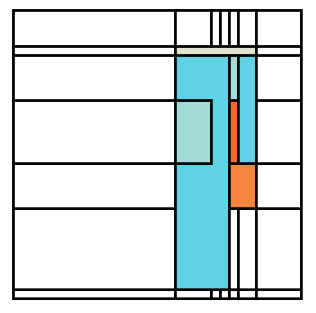
* 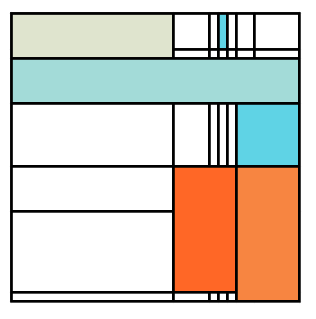
* 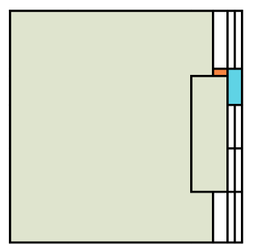
* 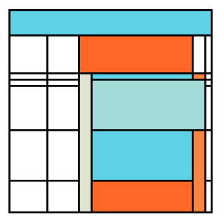
* 
* 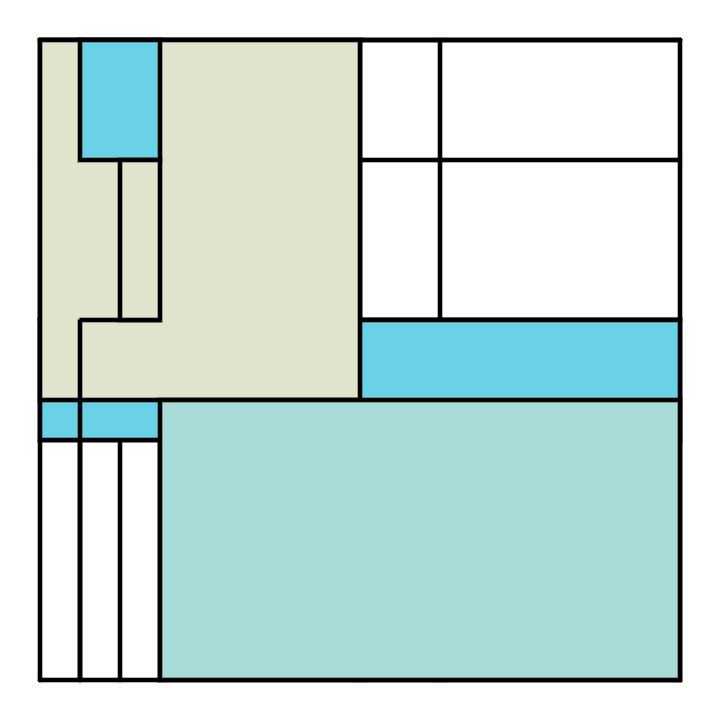
* 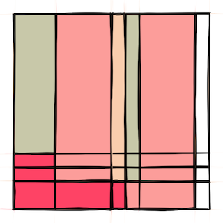
* 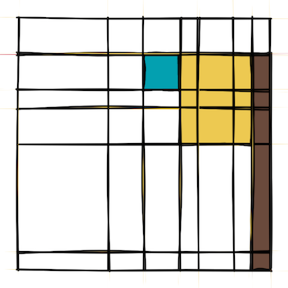
* 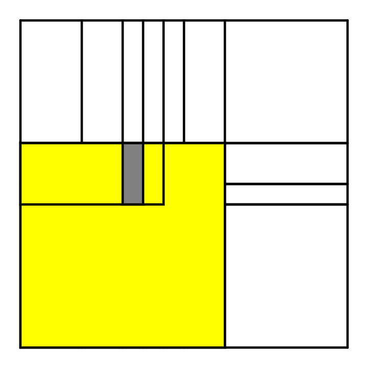
* 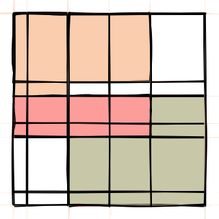
* 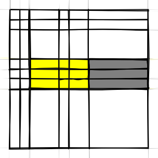
* 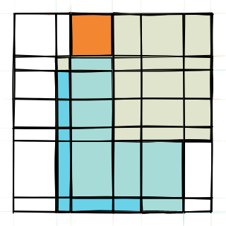
## Collages of screenshots
* 
* 
* 
* 
* 
* 

## Credits

* [felt-tip simulated line function from Nikolaus Gradwohl](https://www.local-guru.net/blog/2010/4/23/simulation-of-hand-drawn-lines-in-processing)
* Code for saving canvas as image courtesy of http://stackoverflow.com/questions/12796513/html5-canvas-to-png-file
* Palettes from colourlovers:
* * [Giant Goldfish by manekineko](http://www.colourlovers.com/palette/92095/Giant_Goldfish)
* * [(???)by sugar!](http://www.colourlovers.com/palette/629637/())
* * [cheer up emo kid by electrikmonk](http://www.colourlovers.com/palette/1930/cheer_up_emo_kid)
* * ["LoversInJapan by lovelyrita"](http://www.colourlovers.com/palette/867235/LoversInJapan)
* * ["Ocean Five by DESIGNJUNKEE"](http://www.colourlovers.com/palette/1473/Ocean_Five)
* * "Entrapped InAPalette by annajak"
* * "mellon ball surprise by Skyblue2u"
* * "fresh cut day by electrikmonk"